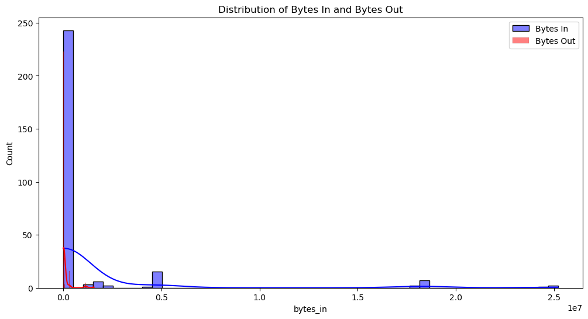
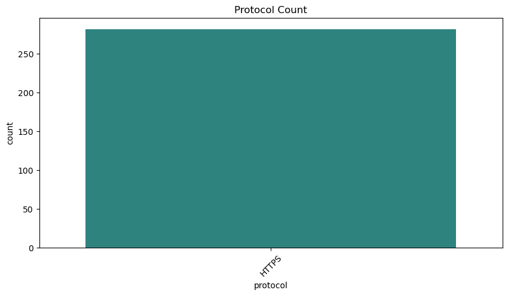
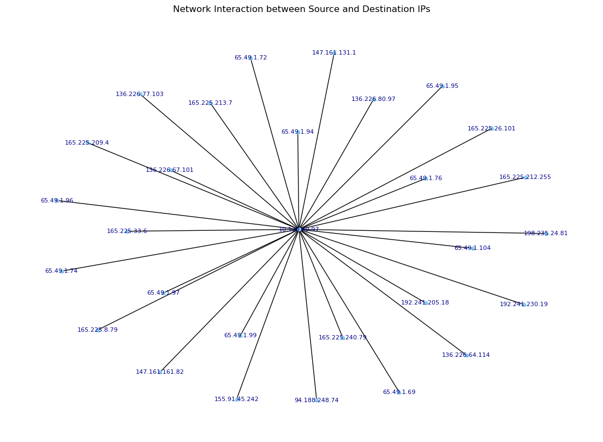
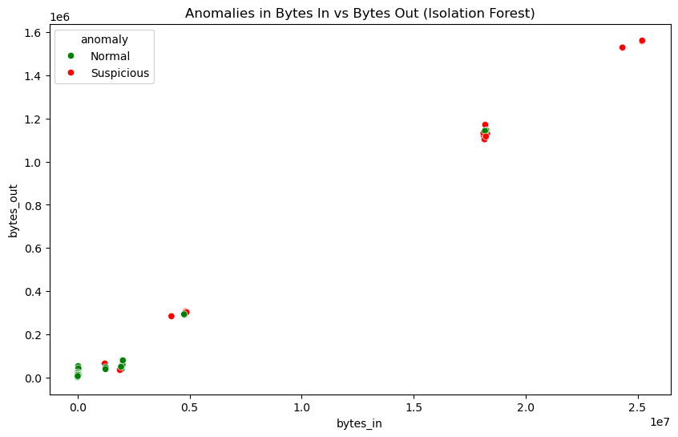
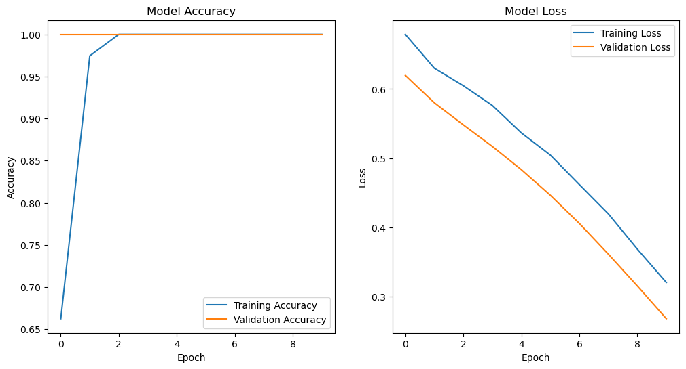

# NLP-Driven Customer Feedback Analysis

## Project Overview
This project uses Natural Language Processing (NLP) techniques to analyze a large dataset of customer reviews. The primary objectives were to understand customer sentiment, identify frequently mentioned topics and keywords, and generate actionable business insights. The analysis involves data preprocessing, exploratory text analysis, sentiment classification, and topic modeling.

## Dataset
The project was conducted using the **Amazon Fine Food Reviews** dataset, which includes a large number of customer reviews with associated ratings, timestamps, and product information.

* **Source:** [https://www.kaggle.com/datasets/snap/amazon-fine-food-reviews](https://www.kaggle.com/datasets/snap/amazon-fine-food-reviews)

## Key Findings
* The overall sentiment of the reviews is highly positive, with 78.38% of the reviews being positive, 14.06% being negative, and the rest being neutral.
* The Sentiment Classification models achieved high accuracy, with the Support Vector Machine (SVM) model performing the best with an accuracy of 83.00%.

* The analysis identified key topics and features driving sentiment, which led to specific recommendations for product improvement, customer communication, and marketing strategy.
* ## 📊 Visualization & Analysis

# Autonomous Malicious Traffic Detection System

## 📌 Project Overview
An orchestrated autonomous system designed to analyze server logs and identify security threats in real-time. By processing over **100,000 log entries daily**, this system differentiates between normative user behavior and potential web intrusions with high precision.

## 🚀 Key Achievements
* **92% Precision:** Achieved through a hybrid model combining Isolation Forest and 1D-CNN.
* **40% Reduction in False Positives:** Engineered a real-time monitoring solution to improve alert accuracy.
* **35% Faster Incident Response:** Optimized data pipelines for automated log processing and scoring.

## 🏗️ System Architecture
The ecosystem utilizes a dual-layer detection strategy:
1. **Unsupervised Outlier Recognition:** Leveraging **Isolation Forest** to identify anomalous spikes and patterns without labeled data.
2. **Deep Feature Extraction:** Implementing a **1D Convolutional Neural Network (1D-CNN)** to analyze sequential patterns in web traffic.

## 📊 Data Visualization & Insights

### 1. Network Traffic Distribution
Analyzes the volume of incoming and outgoing data to establish baseline normative behavior.

### 2. Protocol Frequency Analysis
Identifies anomalies in port usage and communication protocols.

### 3. IP Interaction Network
A graph-based visualization of communication between source and destination IPs.

### 4. Anomaly Detection (Isolation Forest)
Visual representation of how the model separates standard traffic from malicious outliers.

### 5. Deep Learning Performance
Training metrics for the 1D-CNN model showing accuracy and loss convergence.

## 🛠️ Tech Stack
* **Language:** Python
* **Data Processing:** Pandas, NumPy, SQL
* **Machine Learning:** Scikit-learn (Isolation Forest)
* **Deep Learning:** TensorFlow / Keras (1D-CNN)
* **Visualization:** Matplotlib, Seaborn, NetworkX

## 📂 Project Structure
* `PROJECT-1.ipynb`: Core analysis and model training notebook.
* `images/`: Exported visualizations for the security dashboard.
* `data/`: Server log datasets (AWS CloudWatch/VPC Flow logs).

---
*Note: This project was developed to enhance real-time cybersecurity monitoring and automated threat identification.*
